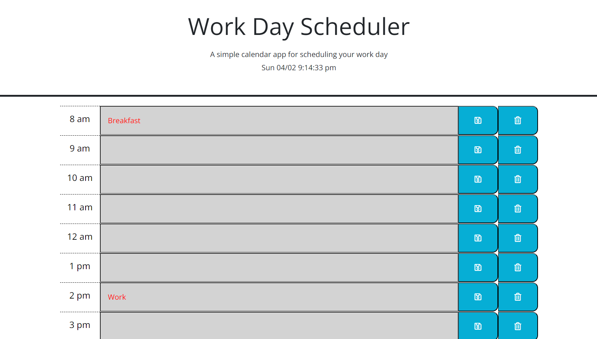

# MahdisWorkDayScheduler

## Your Task

At some point in your journey to become a full-stack web developer, you’ll likely be asked to complete a coding assessment—perhaps as part of an interview process. A typical coding assessment includes both multiple-choice questions and interactive coding challenges.
To help familiarize you with these tests and allow you to use the skills covered in this module, this Challenge invites you to build a timed coding quiz with multiple-choice questions. This app will run in the browser and will feature dynamically updated HTML and CSS powered by JavaScript code that you write. It will have a clean, polished, and responsive user interface.
This week’s coursework will equip you with all the skills you need to succeed in this assignment.

## User Story

```
AS AN employee with a busy schedule
I WANT to add important events to a daily planner
SO THAT I can manage my time effectively
```

## Acceptance Criteria

```
GIVEN I am using a daily planner to create a schedule
WHEN I open the planner
THEN the current day is displayed at the top of the calendar
WHEN I scroll down
THEN I am presented with timeblocks for standard business hours
WHEN I view the timeblocks for that day
THEN each timeblock is color coded to indicate whether it is in the past, present, or future
WHEN I click into a timeblock
THEN I can enter an event
WHEN I click the save button for that timeblock
THEN the text for that event is saved in local storage
WHEN I refresh the page
THEN the saved events persist
```

## Screenshot

The following image shows the web application's appearance and functionality:



## Installation

Github repository:

https://github.com/mahdi83777/MahdisWorkDayScheduler

Deployed application:

https://mahdi83777.github.io/MahdisWorkDayScheduler/

## References

[Day.js] (https://day.js.org/docs/en/parse/string-format)
[JS this] (https://www.w3schools.com/js/js_this.asp)
